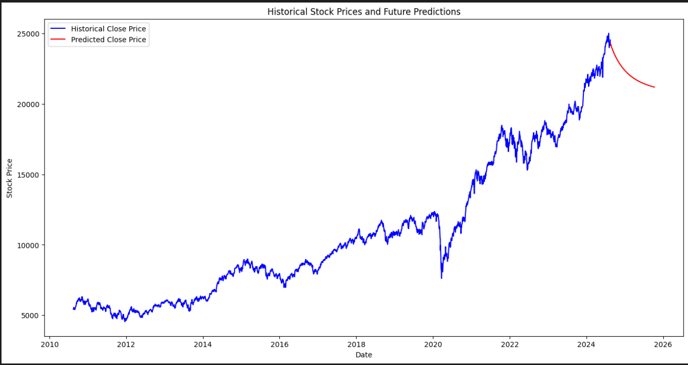

# 📈 Stock Price Prediction App

[](https://streamlit.io/)
[](https://www.python.org/)
[](https://www.tensorflow.org/)

An interactive web application built with Streamlit that predicts stock prices using LSTM (Long Short-Term Memory) neural networks. Upload your historical stock data and get future price predictions with interactive visualizations.

## 📊 Example Prediction



The image above shows a sample prediction for AMD stock:
- Blue line: Historical stock prices (2010-2024)
- Red line: Predicted future prices (2024-2025)
- Notable features:
  - Captures historical growth trends
  - Shows market volatility
  - Predicts potential future price movements

## 🚀 Features

- 📊 Interactive stock price visualization
- 🤖 LSTM-based price prediction
- ⚙️ Customizable prediction parameters
- 📅 Flexible prediction timeframe (1-36 months)
- 📈 Real-time model training
- 🎯 Dynamic time step selection
- 📉 Support for various stock data patterns

## 🛠️ Installation

1. Clone the repository:
```bash
https://github.com/kkarthik3/stock-predictor.git
cd stock-predictor
```

2. Install required packages:
```bash
pip install -r requirements.txt
```

## 📦 Requirements

```text
streamlit
pandas
numpy
matplotlib
plotly
scikit-learn
tensorflow
keras
```

## 🏃‍♂️ Running the App

```bash
streamlit run app.py
```

## 📊 Data Format

Upload a CSV file with the following columns:
- `Date`: Date in YYYY-MM-DD format
- `Close`: Closing price of the stock

Example:
```csv
Date,Close
2023-01-01,150.23
2023-01-02,151.45
...
```

## 🎮 Usage

1. 📂 Upload your CSV file using the sidebar
2. ⚙️ Configure parameters:
   - Time step (1-1000 days)
   - Prediction timeframe (1-36 months)
3. 🔄 Click "Train Model" to train the LSTM model
4. 🎯 Click "Predict Future Prices" to view predictions

## 🏗️ Project Structure

```
├── app.py              # Main Streamlit application
├── model.py            # LSTM model architecture and training
├── requirements.txt    # Project dependencies
└── README.md          # Project documentation
```

## 🔧 Model Architecture

The application uses an LSTM (Long Short-Term Memory) neural network with:
- Input shape based on user-defined time step
- Multiple LSTM and Dense layers
- Dropout layers for preventing overfitting
- Mean Squared Error loss function
- Adam optimizer

## 📊 Visualization Features

The app provides interactive plots using Plotly:
- Historical stock prices with actual data points
- Predicted future prices with trend lines
- Interactive zoom and pan capabilities
- Hover data tooltips showing exact values
- Dual-color scheme for clear distinction between historical and predicted data
- Legend for easy interpretation
- Date-based x-axis with automatic scaling
- Price-based y-axis with dynamic range

## ⚙️ Parameters

- **Time Step**: Number of previous days used to predict the next day
- **Months to Predict**: Number of months to forecast into the future (1-36 months)
- **Training Split**: Last 3 months reserved for testing
- **Training Epochs**: 10 epochs per training session

## 💡 Best Practices

For optimal predictions:
1. Use at least 2 years of historical data
2. Start with a time step of 100 days
3. Begin with a 12-month prediction window
4. Ensure your data is clean and continuous
5. Consider market conditions when interpreting results


## 📝 License

This project is licensed under the [MIT License](LICENSE).

## ⚠️ Disclaimer

This application is for educational purposes only. Stock price predictions are based on historical data and should not be used as the sole basis for investment decisions. Past performance does not guarantee future results.
